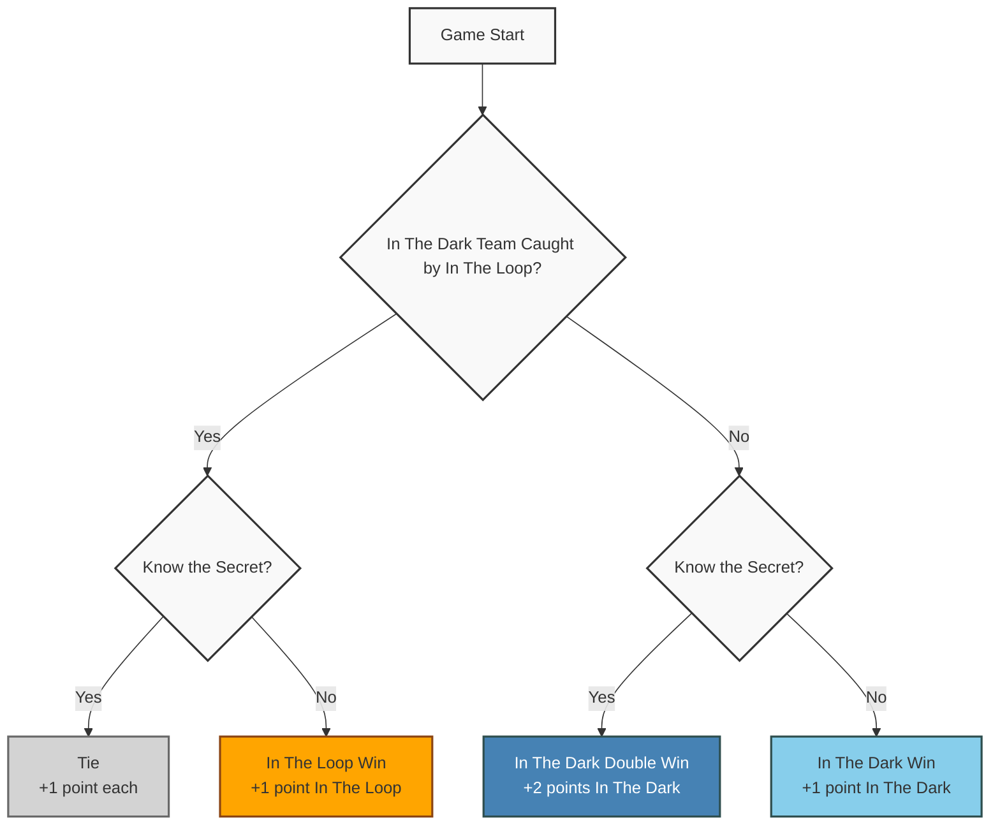
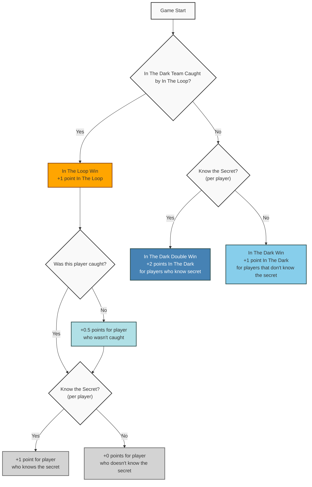

# Multiple "In The Dark" Players Game Rules

This directory contains the implementation and documentation for handling multiple "in the dark" players in the game. The game can be configured to support different team dynamics and winning conditions.

## Fundamental Winning Conditions

The game has four possible outcomes based on two key factors:

1. Whether the "in the dark" players are caught by those "in the loop"
2. Whether the "in the dark" players know the secret

### Outcome Hierarchy

1. **In The Dark Double Win** (Highest)

   - Players are NOT caught by those in the loop
   - Players know the secret
   - Points: +2 points for In The Dark team

2. **In The Dark Win**

   - Players are NOT caught by those in the loop
   - Players do NOT know the secret
   - Points: +1 point for In The Dark team

3. **In The Loop Win**

   - Players ARE caught by those in the loop
   - Players do NOT know the secret
   - Points: +1 point for In The Loop team

4. **Tie** (Lowest)
   - Players ARE caught by those in the loop
   - Players know the secret
   - Points: +1 point for both teams

### Winning Conditions Flow Diagram

## Game Modes

### 1. Single Player Mode (Default)

- Only one player is "in the dark"
- No special team rules or coordination needed
- Standard winning conditions apply:
  - In The Dark Double Win: Not caught and knows the secret (+2 points In The Dark)
  - In The Dark Win: Not caught and doesn't know the secret (+1 point In The Dark)
  - In The Loop Win: Caught and doesn't know the secret (+1 point In The Loop)
  - Tie: Caught but knows the secret (+1 point each)

### 2. Team Mode

In this mode, all "in the dark" players work together as a single team.

#### 2.1 Known Team Members

- Players who are "in the dark" know who their teammates are
- The team is considered "caught" if ANY player in the dark is voted out
- Maximum number of "in the dark" players = ⌊(total players - 1) / 2⌋
  - Example: In a 7-player game, maximum 3 players can be in the dark
  - This ensures there are always more players "in the loop" than "in the dark"
- Team Dynamics:
  - Players always work together as a single unit
  - During the guessing phase, they collaborate to make a single team guess
  - They can discuss and share information to help each other figure out the secret but this must be done in a way that does not reveal the secret to the "in the loop" players
  - The team wins or loses together based on their collective performance
- Same winning conditions as single player mode:
  - In The Dark Double Win: If "in the dark" team is caught and at least one player knows the secret (+2 points In The Dark)
  - In The Dark Win: If "in the dark" team is caught and no one knows the secret (+1 point In The Dark)
  - In The Loop Win: If someone is caught and no one knows the secret (+1 point In The Loop)
  - Tie: If someone is caught but at least one player knows the secret (+1 point each)

#### 2.2 Unknown Team Members

- Players who are "in the dark" know they are part of a team but don't know who their teammates are
- The team is considered "caught" if ANY player in the dark is voted out
- Maximum number of "in the dark" players = ⌊total players / 2⌋
  - Example: In a 6-player game, maximum 3 players can be in the dark
  - This allows there to be the same number of players "in the dark" as "in the loop". But it will be harder for those in the dark to work together and communicate who they are voting for.
  - If each team has the same number of players then a tie goes to the people in the loop.
- Team Dynamics:
  - Players must work together but will not know who their teammates are
  - During the guessing phase, they collaborate to make a single team guess. This is possible since the guessing phase is after the revealing of who is in the dark
  - Players cannot openly collaborate as they don't know who their teammates are.
  - The team wins or loses together based on their collective performance.
- Same winning conditions as single player mode:
  - In The Dark Double Win: If "in the dark" team is caught and at least one player knows the secret (+2 points In The Dark)
  - In The Dark Win: If "in the dark" team is caught and no one knows the secret (+1 point In The Dark)
  - In The Loop Win: If someone is caught and no one knows the secret (+1 point In The Loop)
  - Tie: If someone is caught but at least one player knows the secret (+1 point each)

### 3. Individual Mode

In this mode, each "in the dark" player plays independently, with winning conditions based on who gets caught.

#### 3.1 Competitive Individual

- Players who are "in the dark" don't know who else is in the dark
- Each player competes against all other players
- Winning Conditions based on who gets caught:

1. If caught by someone in the loop:
   - In The Dark Double Win: If player knows the secret (+2 points In The Dark)
   - In The Dark Win: If player doesn't know the secret (+1 point In The Dark)
2. If not caught by someone in the loop:
   - If caught in the dark:
     - Tie: If player knows the secret (+1 point each)
     - In The Dark Half Win: If player doesn't know the secret (+0.5 points In The Dark)
   - If not caught in the dark:
     - In The Dark Win: If player doesn't know the secret (+1 point In The Dark)

- Multiple winners possible if multiple players achieve the same outcome
- Points are tracked for future implementation of a scoring system

## Implementation Considerations

### Game Flow Modifications

1. Setup Phase

   - Need to support selecting multiple "in the dark" players
   - Configuration of game mode (Single Player, Team, or Individual)
     - For Single Player mode: No special setup needed
     - For Team mode: Configuration of team knowledge (Known vs Unknown teammates)
     - For Individual mode: No special setup needed

2. Reveal Phase

   - Modified to handle multiple "in the dark" players
   - Different reveal mechanics based on game mode:
     - Single Player: Standard reveal
     - Team Mode: May reveal team membership based on configuration
     - Individual Mode: Standard reveal (players don't know who else is in the dark)

3. Questions Phase

   - No significant changes needed
   - Questions can be asked to any player regardless of their status

4. Voting Phase

   - Modified to handle multiple potential "in the dark" players
   - Need to track who gets caught and their role (in the loop or in the dark)
   - For Individual mode: Track which "in the dark" player was caught (self or other)
   - For Team mode: Any caught player results in team being caught

5. Guessing Phase

   - Modified to handle multiple guesses
     - Team mode: Single team guess with collaboration, change dialogue telling the team to make a guess together
     - Individual mode: Each player makes their own guess
     - Need to track who knows the secret for winning condition determination.

6. Results Phase
   - Modified to show results for multiple players
   - Different result displays based on game mode
   - Need to show:
     - Who was caught and their role
     - Who knew the secret
     - Final outcome (In The Dark Double Win, In The Dark Win, In The Dark Half Win, In The Loop Win, or Tie)
   - For Individual mode: Show individual results and any In The Dark Half Wins
   - For Team mode: Show team results

### Technical Requirements

1. New game configuration options

   - Game mode selection
   - Team mode settings
   - Player count limits based on mode

2. Modified game state management

   - Track player roles (in the dark, in the loop)
   - Track team membership (if applicable)
   - Track who was caught and their role
   - Track who knows the secret

3. Updated UI components

   - Support for multiple player displays
   - Team collaboration interface
   - Results display for different outcomes
   - In The Dark Half Win tracking and display

4. New winning condition logic

   - Mode-specific condition checking
   - In The Dark Half Win implementation
   - Team vs Individual outcome determination

5. Modified scoring system (for future implementation)

   - In The Dark Double Win points
   - In The Dark Win points
   - In The Dark Half Win points
   - Tie handling

6. Updated game summary display
   - Show all relevant outcomes
   - Display team results
   - Show individual achievements
   - Track and display In The Dark Half Wins

## Future Considerations

1. Points System Implementation

   - In The Dark Double Win: 2x points
   - In The Dark Win: 1x points
   - In The Dark Half Win: 0.5x points
   - Tie: 1x points for everyone
   - Team mode point distribution
